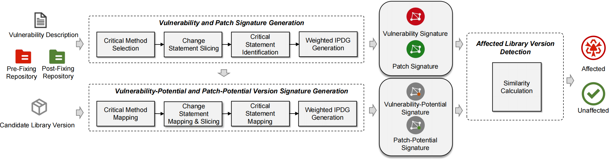

# VisionPro

This folder contains the implementation of `VisionPro`. The system is organized into three main modules, each playing a critical role in vulnerability affected version identification.



## Dependencies

To run this project, you will need the following dependencies:

- **python**: 3.11.8

- **joern**: 2.260

  The installation process for Joern can be found at https://docs.joern.io/installation.

- **tree-sitter**: 0.22.6

  The installation process for tree-sitter can be found at https://tree-sitter.github.io/tree-sitter/

- **UniXcoder**

  The instruction for UniXcoder can be found at https://github.com/microsoft/CodeBERT/tree/master/UniXcoder#2-similarity-between-code-and-nl

- Other relevant dependent packages listed in [requirements.txt](./requirements.txt)

  To setup, just run:

  ```
  pip install -r requirements.txt
  ```

## Modules

- **Modules 1: Vulnerability and Patch Signature Generation**

  This module including the scripts: `ast_parser.py`, `code_transformation.py`, `signatureGeneration.py` , `joern.py`, `project.py` and `patch.py`.

  *entry script: signatureGeneration.py*

  Before executing the script, ensure the following paths are correctly configured in `signatureGeneration.py`:

  1. **Joern Path**: set the path to the Joern on line 17.
  2. **Signature Storage Path**: specify the path to the signature storage directory on line 18.

  ```bash
  python signatureGeneration.py cveid commit_id repo_path 
  ```

  - Input arguments:
    - `cveid`:  the CVE-ID corresponding to the generated vulnerability and patch signature.
    - `commit_id`: the commit_id corresponding to the CVE-ID
    - `repo_path`: the local path of the repository corresponding to the CVE.
  - Output:
    - vulnerability and patch signature stored in the signature storage path specified in `signatureGeneration.py`

- **Modules 2: Vulnerability-Potential and Patch-Potential Version Signature Generation**
  This module including the scripts:  `ast_parser.py`, `code_transformation.py`, `target_signatureGeneration.py` , `joern.py`, `project.py` and `target.py`.

  *entry script: target_signatureGeneration.py*

  Before executing the script, ensure the following paths are correctly configured in `target_signatureGeneration.py`:

  1. **Cache File Path:** set the path to the saga cache.
  2. **Directory of the Files Containing Vulnerable Functions: **specify the directory of the files containing vulnerable functions on line 24
  3. **Path of the Target Detected Repository:**  specify the directory of the target detected repository on line 25.
  4. **File Mapping Storage Path: **specify the path to the target file mapping storage directory on line 26.
  5. **Method Mapping Storage Path:** specify the path to the target method mapping storage directory on line 27.
  6. **Line Mapping Storage Path:** specify the path to the target line mapping storage directory on line 28.
  7. **Vulnerability and Patch Signature Storage Path:** specify the path to the vulnerability and patch signature storage directory on line 29.
  8. **Vulnerability-Potential and Patch-Potential Version Signature Storage Path:** specify the path to the vulnerability-potential and patch-potential version signature storage directory on line 29.
  9. **Joern Path**: set the path to the joern on line 31.

  ```
  python signatureGeneration.py target
  ```

  - Input arguments:
    - `target`: the name of the repository which need to be detected, the format is `target-tag(e.g., ventoy@@Ventoy-v1.0.10)`.
  - Output:
    - Vulnerability-potential and patch-potential version signature stored in the vulnerability-potential and patch-potential version signature storage path specified in `target_signatureGeneration.py`

- **Module 3: Affected Library Version Detection:**

  This module including the scripts: `Detection.py`, `GraphSimCore.py`, `hungarian.py` and `SimilarityService.py`

  *entry script: Detection.py*

  Before executing the script, ensure the following paths are correctly configured in `Detection.py` :

  1. **Vulnerability-Potential and Patch-Potential Version Signature Storage Path:** specify the path to the target vulnerability-potential and patch-potential version signature storage directory on line 12.
  2. **Vulnerability and Patch Signature Storage Path:** specify the path to the Vulnerability and Patch Signature storage directory on line 13.
  3. **Result Storage Path:** specify the path to the detection results on line 14.

  To detect a target repository just enter the directory `hungarian`, and then run:

  ```
  python Detection.py target
  ```

  - Input arguments:
    - `target`: the name of the repository which need to be detected, the format is `target-tag(e.g., ventoy@@Ventoy-v1.0.10)`.
  - Output:
    - The detected results that stored in the results storage path specified in `Detection.py`

